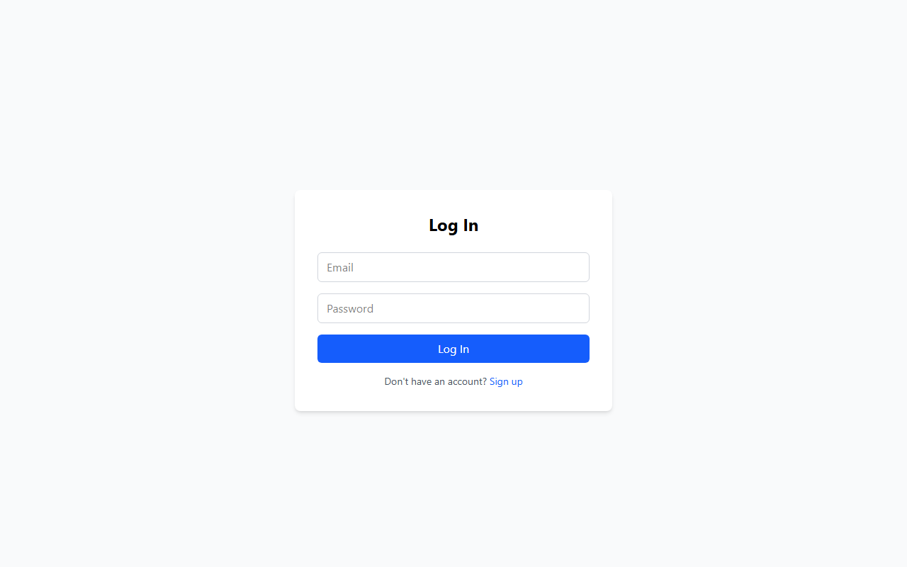
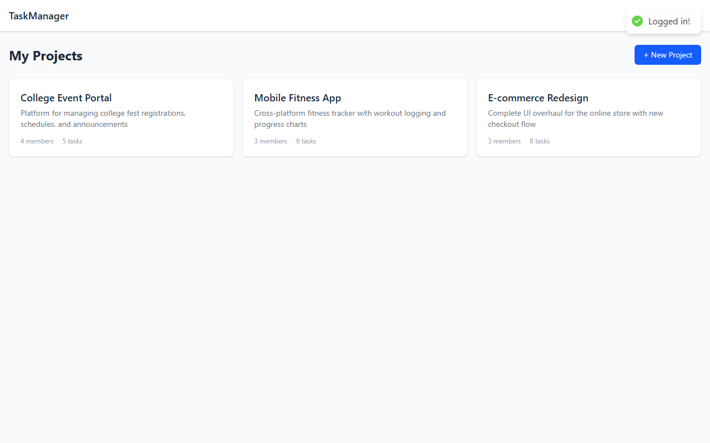
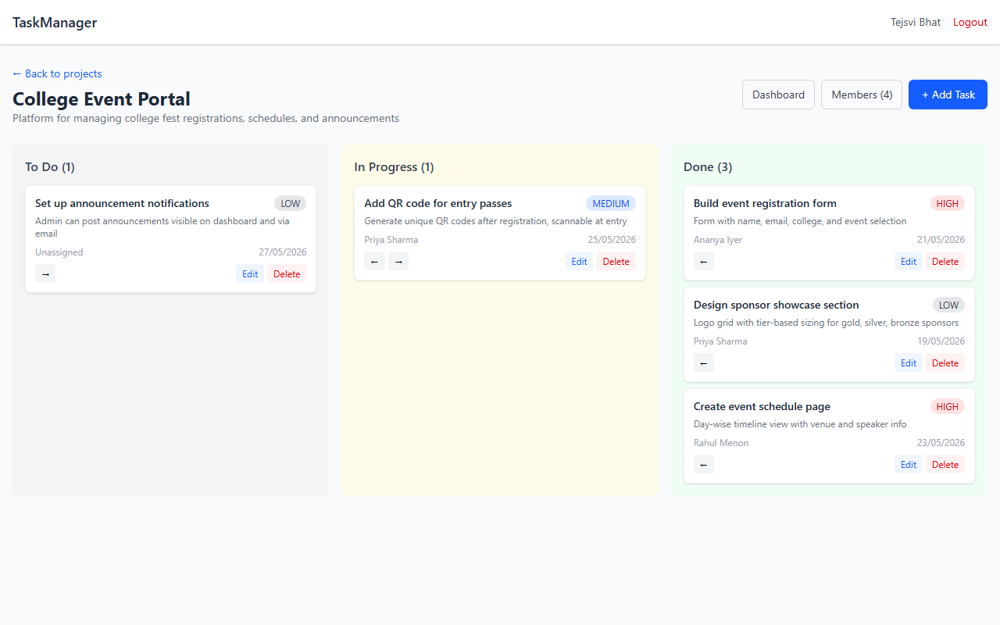
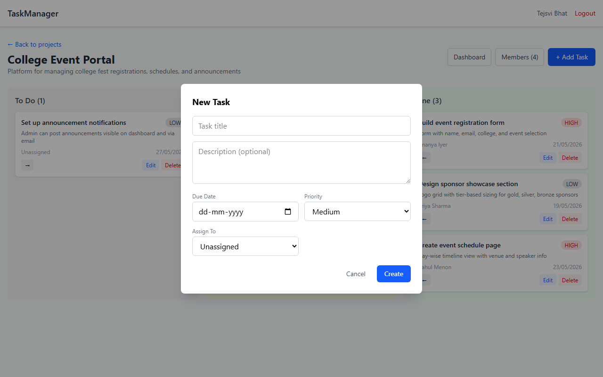
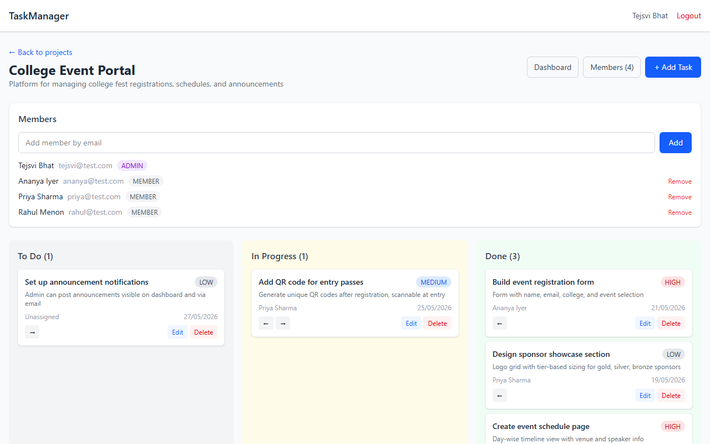
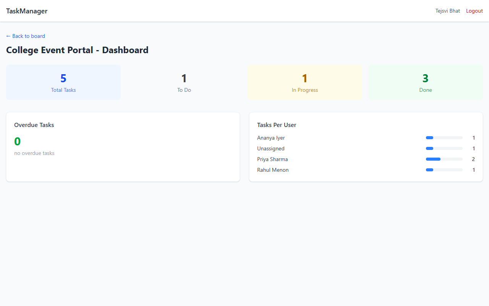

# Team Task Manager

A full-stack collaborative task management web application where users can create projects, manage teams, assign tasks, and track progress. Built as a simplified version of tools like Trello or Asana.

**Live App:** [https://team-task-manager-production-bba5.up.railway.app](https://team-task-manager-production-bba5.up.railway.app)

**GitHub Repo:** [https://github.com/Tejsvi-Bhat/team-task-manager](https://github.com/Tejsvi-Bhat/team-task-manager)

## Screenshots

### Login


### Projects List


### Kanban Board


### Task Creation Modal


### Member Management


### Dashboard


## Features

- **User Authentication** — Signup and login with JWT-based auth
- **Project Management** — Create projects, add/remove members by email
- **Kanban Board** — Tasks organized in To Do / In Progress / Done columns
- **Task Management** — Create, edit, delete, and assign tasks with priority and due dates
- **Dashboard** — Stats overview with total tasks, status breakdown, tasks per user, and overdue count
- **Role-Based Access** — Admins manage everything; Members can only view and update their assigned tasks

## Tech Stack

| Layer | Technology |
|-------|-----------|
| Frontend | React, Vite, Tailwind CSS, React Router, Axios |
| Backend | Node.js, Express v5, JWT (jsonwebtoken, bcryptjs) |
| Database | PostgreSQL (Supabase) with Prisma ORM |
| Deployment | Railway (single service) |

## Project Structure

```
team-task-manager/
├── client/                 # React frontend
│   ├── src/
│   │   ├── components/     # Navbar, TaskModal, MemberManager
│   │   ├── context/        # AuthContext (login state)
│   │   ├── pages/          # Login, Signup, Projects, ProjectBoard, Dashboard
│   │   └── utils/          # Axios API client
│   └── vite.config.js
├── server/                 # Express backend
│   ├── src/
│   │   ├── controllers/    # Auth, Project, Task, Dashboard logic
│   │   ├── middleware/      # JWT auth, role-based access
│   │   ├── routes/         # API route definitions
│   │   └── utils/          # Prisma client instance
│   └── prisma/
│       ├── schema.prisma   # Database schema
│       └── seed.js         # Sample data seeder
├── package.json            # Root build scripts
└── nixpacks.toml           # Railway build config
```

## Database Schema

```
User
  - id (UUID, PK)
  - name, email (unique), passwordHash
  - createdAt

Project
  - id (UUID, PK)
  - name, description
  - createdBy (FK → User)
  - createdAt

ProjectMember
  - id (UUID, PK)
  - projectId (FK → Project)
  - userId (FK → User)
  - role (ADMIN | MEMBER)
  - Unique constraint on (projectId, userId)

Task
  - id (UUID, PK)
  - title, description
  - dueDate, priority (LOW | MEDIUM | HIGH)
  - status (TODO | IN_PROGRESS | DONE)
  - projectId (FK → Project)
  - assigneeId (FK → User, nullable)
  - createdBy (FK → User)
  - createdAt
```

## API Reference

Base URL: `/api`

### Authentication

| Method | Endpoint | Description | Auth |
|--------|----------|-------------|------|
| POST | `/api/auth/signup` | Create a new account | No |
| POST | `/api/auth/login` | Login and get JWT token | No |
| GET | `/api/auth/me` | Get current user info | Yes |

**POST /api/auth/signup**
```json
// Request
{ "name": "John", "email": "john@example.com", "password": "pass123" }

// Response 201
{ "user": { "id": "uuid", "name": "John", "email": "john@example.com" }, "token": "jwt..." }
```

**POST /api/auth/login**
```json
// Request
{ "email": "john@example.com", "password": "pass123" }

// Response 200
{ "user": { "id": "uuid", "name": "John", "email": "john@example.com" }, "token": "jwt..." }
```

**GET /api/auth/me**
```json
// Response 200
{ "user": { "id": "uuid", "name": "John", "email": "john@example.com" } }
```

### Projects

All project endpoints require `Authorization: Bearer <token>` header.

| Method | Endpoint | Description | Role |
|--------|----------|-------------|------|
| GET | `/api/projects` | List user's projects | Any |
| POST | `/api/projects` | Create a new project | Any |
| GET | `/api/projects/:id` | Get project details | Member |
| POST | `/api/projects/:id/members` | Add a member | Admin |
| DELETE | `/api/projects/:id/members/:userId` | Remove a member | Admin |

**POST /api/projects**
```json
// Request
{ "name": "My Project", "description": "Optional description" }

// Response 201
{ "project": { "id": "uuid", "name": "My Project", "description": "...", "members": [...], ... } }
```

**POST /api/projects/:id/members**
```json
// Request
{ "email": "newmember@example.com", "role": "MEMBER" }

// Response 201
{ "member": { "id": "uuid", "userId": "...", "role": "MEMBER", "user": { ... } } }
```

### Tasks

All task endpoints require auth and project membership.

| Method | Endpoint | Description | Role |
|--------|----------|-------------|------|
| GET | `/api/projects/:id/tasks` | List tasks (Members see only assigned) | Member |
| POST | `/api/projects/:id/tasks` | Create a task | Admin |
| PATCH | `/api/projects/:id/tasks/:taskId` | Update a task | Admin (full), Member (status only) |
| DELETE | `/api/projects/:id/tasks/:taskId` | Delete a task | Admin |

**POST /api/projects/:id/tasks**
```json
// Request
{
  "title": "Design homepage",
  "description": "Create wireframes",
  "dueDate": "2026-06-01",
  "priority": "HIGH",
  "assigneeId": "user-uuid"
}

// Response 201
{ "task": { "id": "uuid", "title": "...", "status": "TODO", "assignee": { ... }, ... } }
```

**PATCH /api/projects/:id/tasks/:taskId**
```json
// Request (Admin - can update any field)
{ "title": "Updated title", "status": "IN_PROGRESS", "priority": "MEDIUM", "assigneeId": "uuid" }

// Request (Member - can only update status on assigned tasks)
{ "status": "DONE" }

// Response 200
{ "task": { ... } }
```

### Dashboard

| Method | Endpoint | Description | Role |
|--------|----------|-------------|------|
| GET | `/api/projects/:id/dashboard` | Get project stats | Member |

**GET /api/projects/:id/dashboard**
```json
// Response 200
{
  "total": 8,
  "byStatus": { "TODO": 4, "IN_PROGRESS": 2, "DONE": 2 },
  "perUser": { "Priya Sharma": 3, "Rahul Menon": 2, "Unassigned": 1 },
  "overdue": 1
}
```

## Local Development Setup

### Prerequisites
- Node.js (v18+)
- A PostgreSQL database (e.g. free tier on [Supabase](https://supabase.com))

### Steps

1. **Clone the repo**
   ```bash
   git clone https://github.com/Tejsvi-Bhat/team-task-manager.git
   cd team-task-manager
   ```

2. **Set up environment variables**
   ```bash
   cp .env.example server/.env
   ```
   Edit `server/.env` and fill in:
   ```
   DATABASE_URL="your-postgresql-connection-string"
   JWT_SECRET="any-secret-string"
   NODE_ENV=development
   PORT=5000
   ```

3. **Install dependencies**
   ```bash
   cd server && npm install
   cd ../client && npm install
   ```

4. **Push database schema**
   ```bash
   cd server
   npx prisma db push
   ```

5. **Seed sample data (optional)**
   ```bash
   node prisma/seed.js
   ```

6. **Start development servers**
   ```bash
   # Terminal 1 - Backend
   cd server && npm run dev

   # Terminal 2 - Frontend
   cd client && npm run dev
   ```

7. Open [http://localhost:5173](http://localhost:5173)

### Seed Accounts
| Email | Password | Role |
|-------|----------|------|
| tejsvi@test.com | password123 | Admin on E-commerce & Event Portal |
| priya@test.com | password123 | Admin on Fitness App |
| rahul@test.com | password123 | Member |
| ananya@test.com | password123 | Member |

## Deployment (Railway)

1. Push code to a GitHub repository
2. Go to [railway.com](https://railway.com) and create a new project from the GitHub repo
3. Add these environment variables in Railway dashboard:
   ```
   DATABASE_URL=<your-supabase-connection-string>
   JWT_SECRET=<your-secret>
   NODE_ENV=production
   PORT=3000
   ```
4. Generate a domain under Settings > Networking
5. Railway auto-builds and deploys on every push to `main`

The root `package.json` handles the full build pipeline: installs both server and client deps, builds the React app, and serves it from Express in production.
